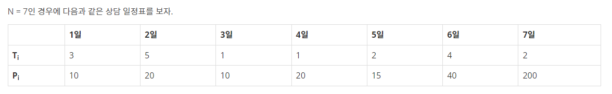

### 풀이법 :

DP[i] = x 라고 했을때,

i 번째 전일까지 일했을때 얻을 수 있는 최대 수익은 DP[i] 라고 하자.

DP[i]의 값 y는 i일에 받을 금액이다. i-1 일까지의 최대 금액이며, i-1일 까지 일한만큼 i일에 돈을 받는다
예를들어 DP[4] 일때, 3일까지 일한 금액을 4일에 받는다.

> 일정표에서\
> 1일을 보았을때 DP[4] = 10 　　　　　　　　　　　　　　　　　　　　// DP[1] = 0\
> 2일을 보았을때 DP[7] = 20 　　　　　　　　　　　　　　　　　　　　// DP[2] = 0\
> 3일을 보았을때도 DP[4] = 10 이다.　　　　　　　　　　　　　　　　// DP[3] = 0, DP[4] = 10\
> 4일을 보았을때 DP[5] = 10 + 20 = 30 　　　　　　　　　　　　　　　// DP[5] = 30\
> 5일을 보았을때 DP[7] = 15 + DP[5] = 45 \
> => 45와 20을 비교해서 더 큰값 45를 저장　　　　　　　　　　　　　 // DP[7] = 45\
> 6일을 보았을때 DP[6]=0 이다. DP[6]이 DP[5]보다 작으므로　　　　　　// DP[6] = DP[5] = 30\
> 6일과 7일 일정은 상담 기간이 초과이므로 기록 x

상담에는 상담 기간이 있기에, 퇴사 전에 상담이 끝나는 경우와 퇴사 후 상담이 끝나는 경우가 존재한다.

퇴사 전에 상담이 끝나는 경우는

1. 그 전날까지의 최대 금액과 퇴사하는 당일 일하는 금액을 더한 것 => DP[4] = DP[3](3일에 받을 돈) + 3일째날 일을 한 수당
2. 퇴사날까지 상담하고 받는 금액 ex) DP[4]
   위 두 가지 경우를 비교해서 더 큰값으로 갱신하면 된다.

퇴사 이후 상담이 끝나는 경우는 돈을 받을 수 없다.

    void solution() {
      for (int i = 1; i <= N + 1; i++) {
        // i = 시간표 일수

        current = max(current, DP[i]);
        // DP[i] = i일전까지 일을 해서 벌 수 있는 최대 액수
        // 현재까지의 최대 수익과 DP[i]를 비교해준 뒤 갱신

        if (i + sch[i][0] > N + 1) continue;
        // 상담이 퇴사일보다 늦게 끝나면 돈을 받을 수 없다 (시간표 일수에서 상담 시간을 더한 것과 퇴사일 비교)
        DP[i + sch[i][0]] = max(sch[i][1] + current, DP[i+sch[i][0]]);
        // 그 전날까지의 최대 금액(current)과 당일 일하는 것을 더한것과 퇴사날 당일까지 일하고 받는 금액을 비교해서 더 큰값이 최대값
      }
    }
